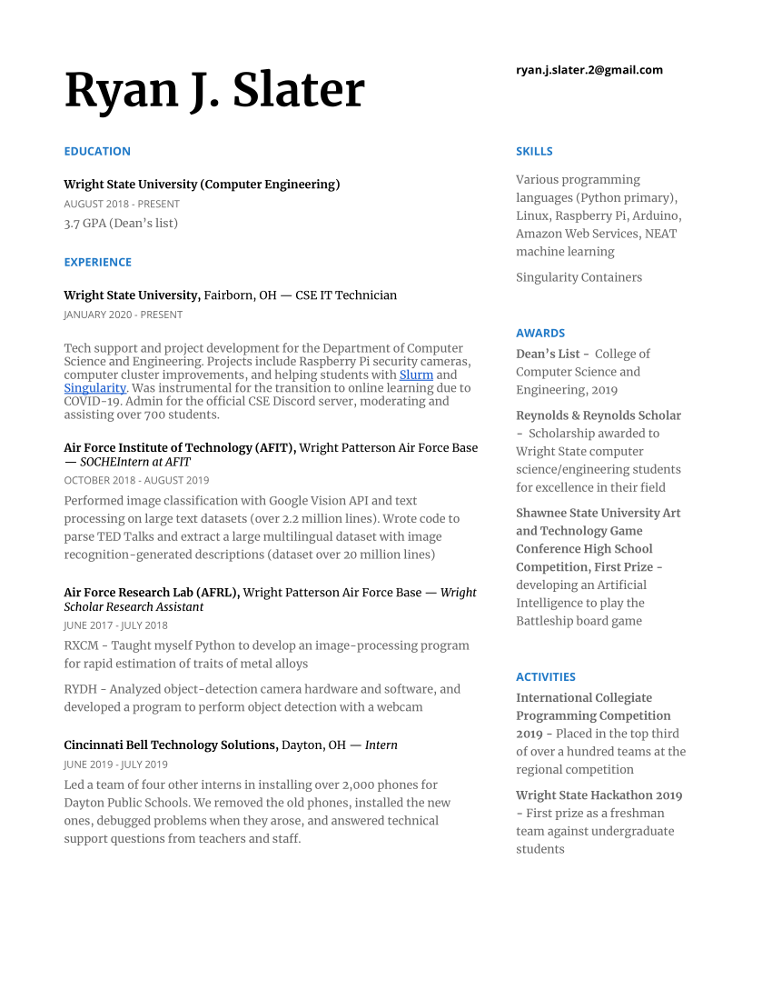

### Welcome to my GitHub page!

I'm an undergraduate Computer Engineering student at Wright State University with an interest in Python programming and PC hardware

Some of my favorite projets so far are my [2048 AI](https://github.com/CodingPenguin1/2048-NEAT) and [Jarvis voice assistant](https://github.com/CodingPenguin1/JARVIS-Voice-Assistant)

I daily Arch Linux on both my laptop and desktop, and have an [install guide](https://github.com/CodingPenguin1/ArchLinuxInstallGuide) and [repo for some utility scripts](https://github.com/CodingPenguin1/Utils) I use a lot

Here's a resume with some of my computer science-related work experiences and achievements

